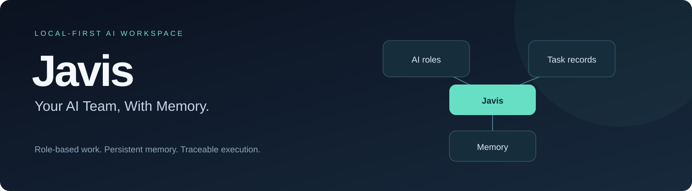
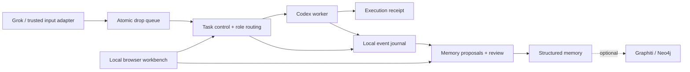

<p align="center"></p>

<p align="center">
  <a href="LICENSE"></a>
  
  
  
</p>

<p align="center"><strong>Give your AI team a shared workspace, lasting memory, and a traceable record of its work.</strong></p>
<p align="center"><a href="README.zh-CN.md">简体中文</a> · <a href="#try-it-without-an-api-key">Quick start</a> · <a href="docs/architecture.md">Architecture</a> · <a href="docs/setup.md">Setup</a> · <a href="CONTRIBUTING.md">Contribute</a></p>

Javis is a **local-first AI agent workspace** built around Grok as the conversational entry and Codex as the local execution worker. It connects role-specific tasks, an append-only event record, reviewable memory, and a browser workbench.

**Developer preview:** this is a sanitized source release from a personal deployment. The offline demo is self-contained; connecting real agents, providers, and scheduled services requires configuration. “Agent OS” describes the workspace layer, not an operating system.

## Why Javis?

Long-running AI work needs more than a chat history: which role owns a task, what was actually executed, which facts are confirmed, and where each result came from.

| Capability | What is in the source |
| --- | --- |
| **A team with separate roles** | Role registry, per-role workspaces, task routing and atomic drop queues |
| **Memory you can inspect** | Structured fact ledger, source references, review decisions, revisions and optional Graphiti/Neo4j projection |
| **Work you can trace** | Preserved inputs, task attempts, execution receipts, artifact references and replay protection |
| **A local workbench** | Task, memory and usage views; localhost owner verification with passkeys |
| **Explicit data boundaries** | Local credential storage, redaction, encrypted sensitive originals and scoped worker access |

The example registry contains 12 roles, including coordination, research, operations, idea exploration and personal assistance. All published bot identities are **synthetic examples**.

## How it fits together



## Try it without an API key

Requires **Python 3.10+ on Linux or WSL**. The core uses POSIX file locking.

```bash
git clone https://github.com/xuxiaoxiang0721-tech/javis-agent-os.git
cd javis-agent-os
python3 examples/offline_demo.py
```

The demo uses synthetic text in a temporary directory and exercises the real task-control code:

1. Accept a task for the research role.
2. Replay the same submission and verify it resolves to the same task.
3. Read its queued state and source references.
4. Verify the local event journal exists.

It does not start a worker or call a model. Expected output includes:

```json
{
  "same_task_on_replay": true,
  "replayed": true,
  "state": "queued",
  "attempt": 0,
  "event_journal_present": true
}
```

To explore the browser workbench and configure integrations, follow [Setup](docs/setup.md).

## Repository map

```text
scripts/                  Task runtime, dispatch, RAW recording and memory controls
scripts/orchestration/    Fixed-work and Flowise integration code
scripts/windows/          Windows deployment templates
tools/control-panel/     Browser workbench assets
tools/memory-adapter/     Structured ledger and optional graph adapter
tools/raw-index/          Event-to-SQLite indexing helpers
config/                   Public JSON schemas
examples/                 Offline first-run demo
tests/                    Synthetic fixtures and regression tests
```

Personal chat histories, source imports, account credentials, local state, backups, and deployment-specific configuration are excluded.

## Current boundaries

- Full agent execution needs a compatible Codex CLI, authenticated providers and reviewed role mappings.
- The core runtime targets Linux/WSL. Windows scheduling and lifecycle scripts are reference templates with paths to adapt.
- Local role separation is not a separate OS user boundary.
- This release's offline checks do not validate a fresh full deployment, cloud roundtrips, unattended approvals or live provider behavior.
- Graph databases and third-party runtimes are installed separately, not bundled.

See [Validation](docs/validation.md) for the exact checks run on this public snapshot.

## Help shape the next version

The next useful improvements are a portable setup flow, configurable identity mappings, a guided memory-review demo, and broader clean-install coverage. See [Contributing](CONTRIBUTING.md).

If you want AI work to be easier to resume and verify, **star Javis to follow its development**. Reproducible bug reports and small, focused improvements are welcome.

## License

[MIT](LICENSE). Third-party dependencies retain their own licenses.
